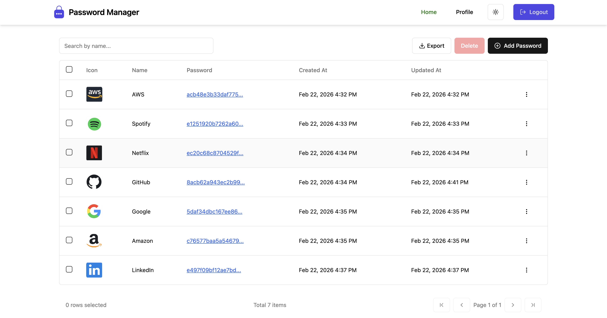
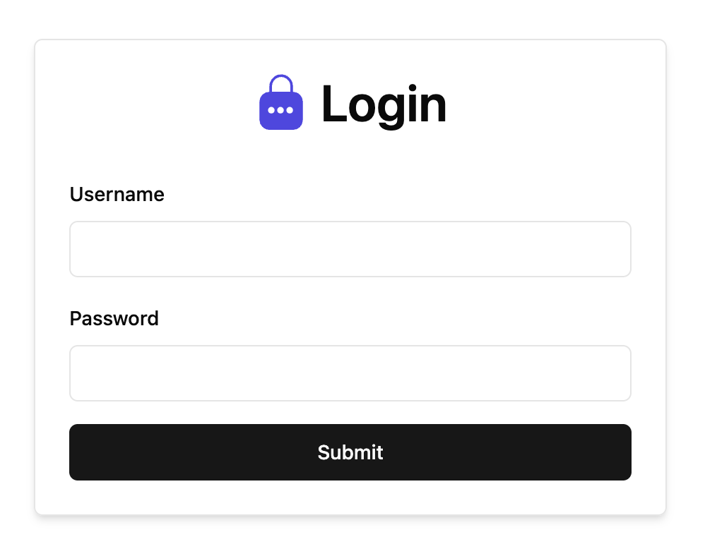
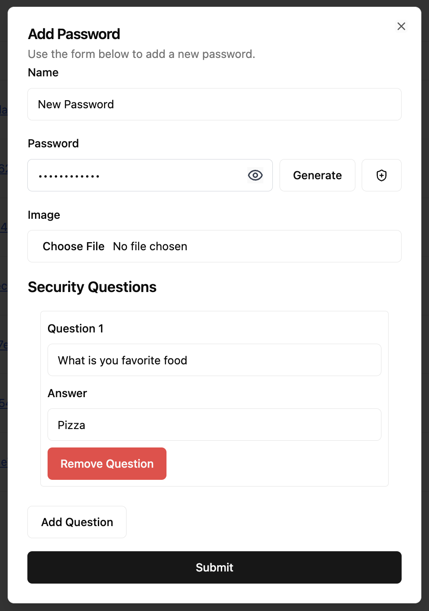
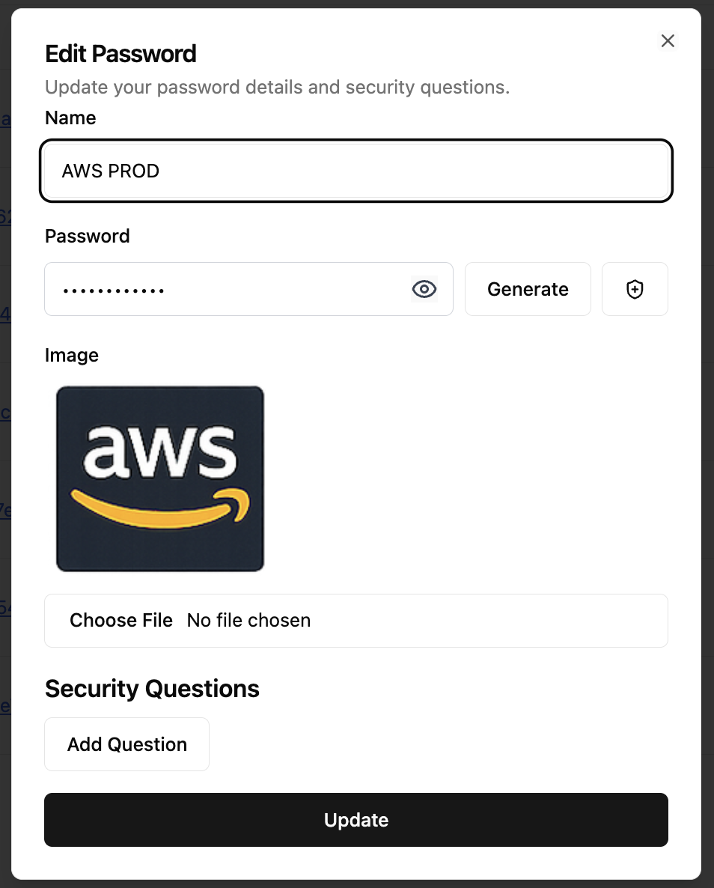
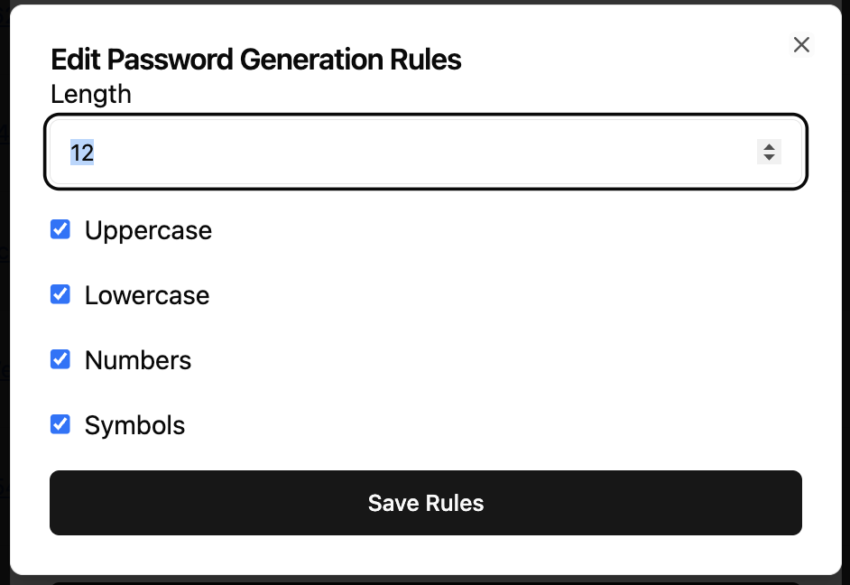
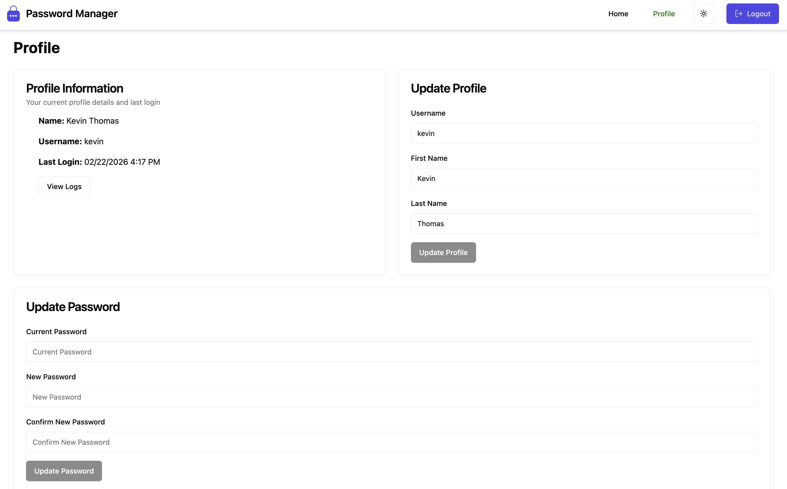
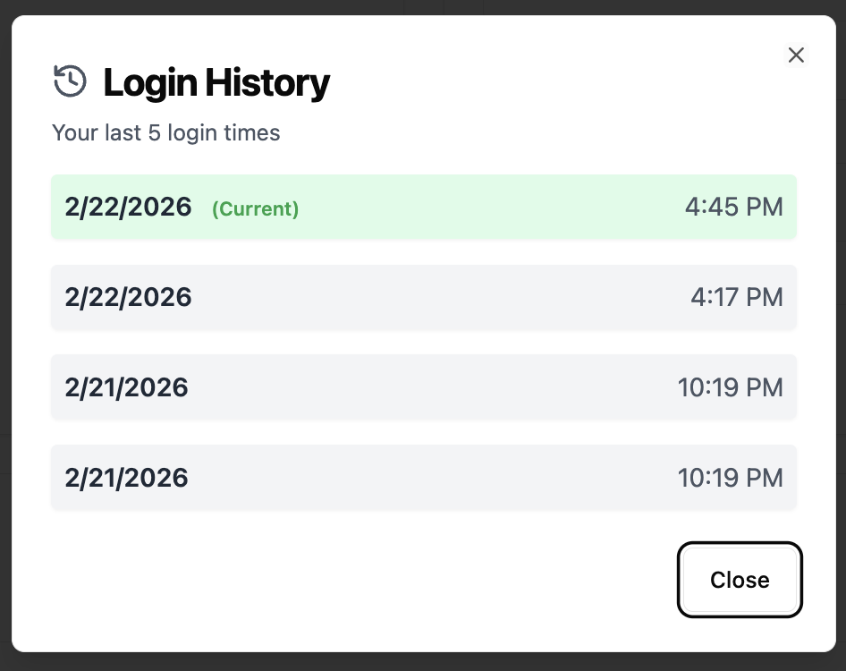

# Password Manager

A full-stack password manager application for securely storing and managing your passwords.

## About

This application allows users to:
- Register and login with secure authentication
- Store passwords with encryption
- Generate strong passwords
- Manage user profile and security questions

## Screenshots

### Home


### Login


### Add Password


### Edit Password


### Password Generation Rules


### Profile


### Login History


## Technologies

### Frontend
- [React](https://react.dev/)
- [TypeScript](https://www.typescriptlang.org/)
- [Vite](https://vitejs.dev/)
- [Tailwind CSS](https://tailwindcss.com/)
- [shadcn/ui](https://ui.shadcn.com/)
- [Zustand](https://zustand-demo.pmnd.rs/)
- [Axios](https://axios-http.com/)
- [React Hook Form](https://react-hook-form.com/)

### Backend
- [Node.js](https://nodejs.org/)
- [Express](https://expressjs.com/)
- [TypeScript](https://www.typescriptlang.org/)
- [Drizzle ORM](https://orm.drizzle.team/)
- [SQLite](https://www.sqlite.org/)
- [Zod](https://zod.dev/)
- [Jest](https://jestjs.io/)

## Getting Started

### Backend
```bash
cd backend
cp .env.example .env
# Update .env with your values
npm install
npm run generate
npm run migrate
npm run dev
```

### Frontend
```bash
cd frontend
cp .env.example .env
npm install
npm run dev
```

## License

MIT
